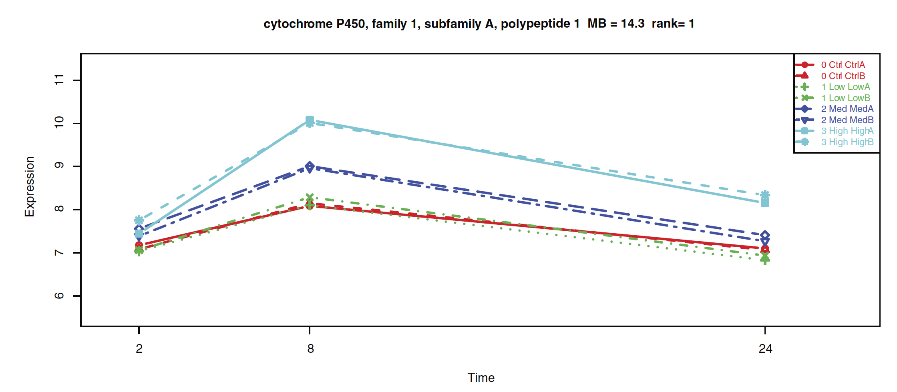

```{r setup, include = FALSE, cache = FALSE, message = FALSE}

library("knitr")

#opts_knit$set(root.dir=normalizePath('../'))

### Chunk options: see http://yihui.name/knitr/options/ ###

## Text results
opts_chunk$set(echo = TRUE, warning = TRUE, message = FALSE, include = TRUE)

## Cache
opts_chunk$set(cache = 3, cache.path = "output/cache/")

## Plots
opts_chunk$set(fig.path = "output/figures/")

```

## Plotting gene expression changes from TG-GATEs dataset

Our first case study is based on a plot from a paper by Rangel-Escareño et al., in which gene expression changes of CYP1A1 (gene associated with xenobiotic metabolism) has been plotted at all concentrations and time points. The plot shows clear differential expression at time 8(hr) suggesting that higher the dose, larger the impact of CCL4 on this gene.
For plotting the gene expression under same conditions using the package, the first step is to load the datasets from disk or download them using the downloadTSet function above. In the following example, we use the toy dataset provided with the package to illustrate the process. 
To plot, the function drugGeneResponseCurve has been used wherein mandatory inputs such as dataset, drug name, cell-line, molecular type, gene name, dose and time points should be specified.

```{r, eval = FALSE, message = FALSE, results = 'hide'}
install.packages("ToxicoGx")
```

**Plot time dependent dose response of Carbon tetra chloride on CYP1A1 gene**
```{r, message = FALSE, fig.width = 8, fig.height = 3}
library(PharmacoGx)
library(ToxicoGx)
library(ggplot2)

# Load the tset 
data(TGGATESsmall)
ToxicoGx::drugGeneResponseCurve(TGGATESsmall, 
                      duration = c("2", "8", "24"), 
                      cell_line = "Hepatocyte", mDataTypes = "rna", 
                      features = "ENSG00000140465_at",
                      dose = c("Control", "Low", "Middle", "High"),
                      drug = "Carbon tetrachloride",
                      ggplot_args = list(labs(title="Effect of Carbon tetra chloride on CYP1A1")),
                      summarize_replicates = FALSE
                      )

```

```{r, echo = FALSE}

```

## Connectivity map analysis on TG-GATEs and human hepatocarcinoma signatures

For the second case study, we will recreate an analysis from the paper by Jos Kleinjans et al., wherein connectivity mapping has been used to predict compound carcinogenicity
by linking in vivo human hepatocarcinoma (HCC) signature geneset with in vitro TG-GATEs primary human hepatocyte data. In this example, we are using the toy dataset. The full dataset has to be downloaded to carry out the whole analysis done in the paper.
The HCC signature, already mapped to the gene level, has been included in this package and it can be loaded by calling data(HCC_sig). Once the dataset is loaded, recreate drug signatures for each drug using the function drugPerturbationSig to peform statistical modelling of the transcriptomic response to the application of each drug. We then compare the observed up-regulated and down-regulated genes to HCC signature published in the paper. The output will be the GSEA connectivity score with FDR values that can be used to determine the correlation between the two signatures.


```{r, results = 'asis'}
library(xtable)
#ata("TGGATESsmall")
# To compute the effect of drug concentration on the molecular profile of the cell
drug.perturbation <- ToxicoGx::drugPerturbationSig(tSet = TGGATESsmall,
                                         mDataType = "rna",
                                         cell_lines = "Hepatocyte",
                                         duration = "24",
                                         dose = c("Control", "Low"),
                                         drugs = c("Omeprazole", "Isoniazid"),
                                         returnValues=c("estimate","tstat", "pvalue", "fdr"),
                                         verbose = FALSE)
data(HCC_sig)
res <- apply(drug.perturbation[,,c("tstat", "fdr")],
             2, function(x, HCC){
               return(PharmacoGx::connectivityScore(x = x,
                                        y = HCC[,2,drop = FALSE],
                                        method = "fgsea", nperm = 100))
             },
             HCC = HCC_sig[1:199,])
rownames(res) <- c("Connectivity", "P Value")
res <- t(res)
res <-  cbind(res,"FDR" = p.adjust(res[,2], method = "fdr"))
res <- res[order(res[,3]),]
xtable::xtable(res,
       caption = 'Connectivity Score results for HCC and TG-GATEs PHH gene
       signature')
```

In the above table, omeprazole showed a positive connectivity score in contrast to isoniazid. This observation aligns with the trends reported in the paper. The above example is to demonstrate the ease with which drug perturbation analysis can be done using ToxicoGx package.

